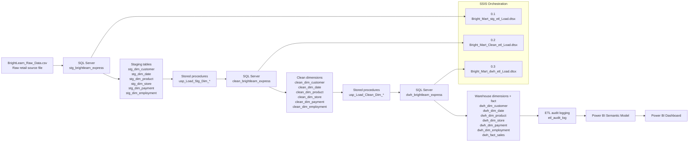
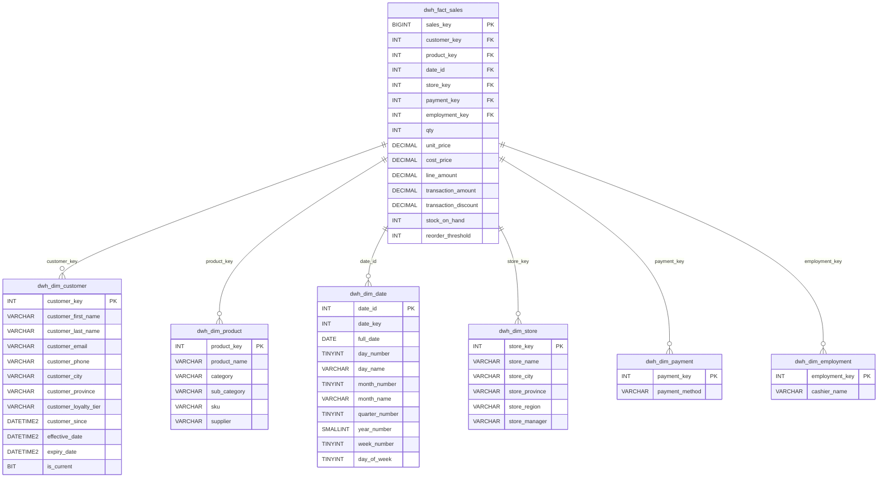
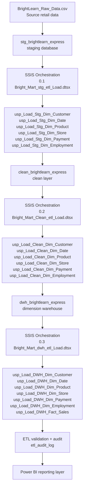

# BrightMart Data Warehouse Project

## Project Overview
This project demonstrates a complete SQL Server-based retail data warehouse implementation using a Bronze → Silver → Gold architecture. The objective was to take raw retail data, validate and clean it, build a dimensional warehouse, and provide a reporting layer that supports business decision-making.

The workflow follows a practical medallion pattern: raw source data is landed in the bronze layer, normalized and staged in the silver layer, and then transformed into a curated reporting-ready warehouse in the gold layer. The project includes:
- Raw source ingestion from the BrightLearn retail export
- Staging and normalization in SQL Server
- Clean dimension preparation for analytics use
- Warehouse modeling with a star schema
- SCD Type 2 handling for customer history
- Fact table loading with integrity constraints
- Stored procedure-based ETL automation
- Audit logging and execution tracking
- Power BI reporting for business analysis

---

## Architecture & Visual Documentation

### 1. End-to-End Data Pipeline Diagram

This flow reflects the repository structure: the raw BrightLearn export is first landed in the SQL Server staging database, then cleaned into the clean layer, then loaded into the warehouse dimension and fact tables for BI consumption.

### 2. Data Warehouse / Star Schema Diagram

The star schema is centred on `dwh_fact_sales` and connects to the repository’s six dimensions: `dwh_dim_customer`, `dwh_dim_product`, `dwh_dim_date`, `dwh_dim_store`, `dwh_dim_payment`, and `dwh_dim_employment`.

### 3. ETL Processing Diagram

This ETL flow matches the repository’s actual SQL and SSIS design: the staging package loads raw data into `stg_brightlearn_express`, the clean package standardizes it, and the warehouse package loads the final dimensions and fact table with audit tracking in `etl_audit_log`.

### 4. Power BI Reporting Layer

I used Power BI Desktop to connect to the SQL Server warehouse, build the semantic model, and create the final reporting pages from the `dwh_brightlearn_express` tables. The process followed the repository flow: load the warehouse tables, establish relationships between the fact and dimensions, create key business measures, and then design the dashboard pages for executive, customer, and operations reporting.

#### Power BI Build Flow

1. Connect Power BI to the SQL Server warehouse (`dwh_brightlearn_express`).
2. Import the fact table and dimension tables: `dwh_fact_sales`, `dwh_dim_customer`, `dwh_dim_product`, `dwh_dim_date`, `dwh_dim_store`, `dwh_dim_payment`, and `dwh_dim_employment`.
3. Create relationships using the warehouse keys and surrogate keys defined in the fact table.
4. Build measures for revenue, quantity, transaction value, stock position, and customer/loyalty insights.
5. Design separate reporting pages for leadership, customer/product analysis, and inventory operations.

#### Step 1: Executive Overview Page

This was the first leadership-facing page in the Power BI model. I used it to summarize revenue performance, sales activity, and high-level operational health so senior stakeholders could see the business status quickly. The important visuals are the KPI-style summary and trend-based views that communicate overall performance at a glance.

#### Step 2: Customer and Product Analysis Page

This page focuses on customer behaviour and product performance. I used the warehouse dimensions to segment customer activity and compare revenue contribution by product/category, which supports merchandising and loyalty decisions. The key visuals here are the customer/product comparison views and the product performance indicators derived from the sales fact table.

#### Step 3: Inventory and Operations Page

This page highlights stock health and operational monitoring. I built this view to make inventory risk and store operations easier to assess, using the fact table fields such as stock levels, reorder thresholds, and transaction activity. The important visuals are the inventory and operational KPI cards that help identify low-stock or high-risk product positions.

This Power BI layer is the final reporting interface for the BrightMart warehouse and brings together the SQL Server ETL pipeline, the dimensional model, and the business analysis needed for decision-making.

## Project Objectives
The main goals of this project were to:
- Build a dimensional warehouse for BrightMart retail analytics.
- Design a repeatable ETL process in SQL Server.
- Standardize and cleanse raw transactional data before it reached the reporting model.
- Remove duplicate and inconsistent values from the source feed.
- Preserve customer history using SCD Type 2 logic.
- Track ETL execution with audit logging and validation.
- Deliver a reporting-ready model for Power BI dashboards and business analysis.

## Stage 1 - Bronze Layer: Raw Landing
I started by loading the raw CSV into BrightLearn_Raw_Data as the Bronze landing layer. This is where the original source feed first enters the medallion architecture before any SQL-based quality cleanup begins.

From there, I created the Silver staging dimensions for:
- Customer
- Date
- Product
- Store
- Payment
- Employment

I then loaded distinct records into the staging schema so the data was prepared for the next transformation step.

## Stage 2 - Silver Layer: Staging and Standardization
This is the Silver layer where I prepared the data for business use. The staging tables were built to hold the raw source rows in a structured format, and then I standardized them into a cleaner representation that the Gold layer could consume confidently.

Typical transformations included:
- UPPER() for names
- LOWER() for email addresses
- LTRIM/RTRIM
- ISNULL defaults
- Duplicate removal with ROW_NUMBER()
- NOT EXISTS incremental loading

Special handling:
- Customer duplicates were resolved using first name, last name, and the most complete email field.
- Product duplicates were resolved by SKU while prioritizing the most complete category and supplier values.

## Stage 3 - Silver to Gold Clean Layer
I transformed each staging dimension into a cleaned version that was ready for the Gold layer. This step is where the medallion design starts to become visible as data moves from raw and somewhat messy to trustworthy and business-ready.

The clean dimensions were then used as the foundation for the final warehouse load, so the reporting model would not be based on unreliable data.

## Audit Logging
I also built audit logging into each ETL stored procedure so the pipeline could be monitored, traced, and validated throughout the load process.

The audit table captures:
- Batch ID
- Procedure Name
- Start Time
- End Time
- Rows Inserted
- Status
- Error Message
- Table Name
- Layer Name

TRY...CATCH and transaction control help keep the loads reliable.

## Data Warehouse (Gold Layer)
Once the clean layer was ready, I loaded the Gold warehouse model from those cleaned dimensions.

The customer dimension uses SCD Type 2 so historical changes can be tracked over time:
- Effective Date
- Expiry Date
- Is_Current flag

The other dimensions use incremental NOT EXISTS loading.

The fact table stores the business measures and surrogate keys needed for reporting:
- Date Key
- Customer Key
- Product Key
- Store Key
- Payment Key
- Employment Key
- Quantity
- Revenue
- Unit Price
- Cost Price
- Discount
- Stock on Hand
- Reorder Threshold

Foreign keys enforce referential integrity across the model.

## Reporting
The reporting layer answers business questions such as:
1. Top 5 products by revenue
2. Monthly revenue per store
3. Month-over-month revenue growth using LAG()
4. Top 10 loyalty customers
5. Customers inactive since 28-Apr-2024
6. Average transaction value by loyalty tier
7. Quantity sold by category and store
8. Inventory below reorder threshold

Key findings from the analysis included:
- Every customer purchased after 28 April 2024.
- No June inventory was below reorder threshold.
- January growth is NULL because there is no previous month.

## Layer Summary

| Medallion Layer | Purpose | Main Objects |
|---|---|---|
| Bronze | Raw retail transaction landing | BrightLearn_Raw_Data |
| Silver | Initial landing, staging, and standardization | stg_dim_* |
| Gold | Cleaned, curated, reporting-ready dimensions and facts | clean_dim_*, dwh_dim_*, dwh_fact_sales |
| Audit | ETL tracking and monitoring | etl_audit_log |

## SSIS Integration Project
I also built an SSIS integration project in the repository under the Bright_Mart_Project folder so I could automate the entire ETL workflow end-to-end.

What I did in SSIS was turn the SQL stored-procedure pipeline into a visual orchestration process. Instead of executing each procedure manually, I connected the stages into ordered packages that run one after the other.

### SSIS workflow I implemented

#### 1. Staging package
Package: 0.1. Bright_Mart_stg_etl_Load.dtsx

In this package, I created Execute SQL Task components for the staging procedures and linked them in sequence:
1. usp_Load_Stg_Dim_Customer
2. usp_Load_Stg_Dim_Date
3. usp_Load_Stg_Dim_Product
4. usp_Load_Stg_Dim_Store
5. usp_Load_Stg_Dim_Payment
6. usp_Load_Stg_Dim_Employment

This stage lands the raw source data into the Silver staging database and prepares it for transformation.

#### 2. Clean package
Package: 0.2. Bright_Mart_Clean_etl_Load.dtsx

In the clean package, I chained the clean-layer procedures so the staging data could be transformed into business-ready dimensions.

The sequence was:
1. usp_Load_Clean_Dim_Customer
2. usp_Load_Clean_Dim_Date
3. usp_Load_Clean_Dim_Product
4. usp_Load_Clean_Dim_Store
5. usp_Load_Clean_Dim_Payment
6. usp_Load_Clean_Dim_Employment

This stage is where I standardized the fields, cleaned inconsistent values, and removed duplicate records.

#### 3. Warehouse package
Package: 0.3. Bright_Mart_dwh_etl_Load.dtsx

In the Gold package, I ran the warehouse load procedures in order so the dimensions and fact table could be built for reporting.

The execution order was:
1. usp_Load_DWH_Dim_Customer
2. usp_Load_DWH_Dim_Date
3. usp_Load_DWH_Dim_Product
4. usp_Load_DWH_Dim_Store
5. usp_Load_DWH_Dim_Payment
6. usp_Load_DWH_Dim_Employment
7. usp_Load_DWH_Fact_Sales

This final stage gave me the Gold reporting model with the fact table and dimension keys ready for analysis.

### Why I used SSIS
I used SSIS because it let me turn the ETL process into something visual, structured, and repeatable. It helped me:
- automate the whole SQL loading chain
- control execution order with precedence constraints
- reuse SQL Server connections across the three environments
- monitor the package flow more clearly
- make the ETL process easier to explain and present

### SSIS screenshots and illustrations I captured
I saved a set of screenshots and diagrams in the ETL screenshots folder so the SSIS story is documented visually as well as in SQL.

These visual assets show the architecture, the SSIS package flow, and the successful execution results:
- SSIS_Load_stg_etl_pipeline.PNG - staging package design
- SSIS_Load_clean_etl_pipeline.PNG - clean package design
- SSIS_Load_dwh_etl_pipeline.PNG - warehouse package design
- SSIS_Load_stg_etl_pipeline_execute_results.PNG - staging execution output
- SSIS_Load_clean_etl_pipeline_execute_results.PNG - clean execution output
- SSIS_Load_dwh_etl_pipeline_execute_results.PNG - warehouse execution output
- SSIS_stg_etl_ran_successfully.PNG - staging success confirmation
- SSIS_Clean_etl_ran_successfully.PNG - clean success confirmation
- SSIS_dwh_etl_ran_successfully.PNG - warehouse success confirmation
- bright_mart_express_diagram.PNG - architectural overview diagram
- audit_logging_stg_dim_customer.PNG - staging audit evidence
- audit_logging_clean_dim_customer.PNG - clean audit evidence
- audit_logging_dwh_dim_customer.PNG - warehouse audit evidence
- audit_logging_dwh_fact_sales.PNG - fact table audit evidence

These screenshots and diagrams are the visual proof that my SSIS workflow was built and executed successfully.

## Skills Demonstrated
- SQL Server
- ETL Design
- Data Cleansing
- Window Functions
- Star Schema
- SCD Type 2
- Transactions
- TRY...CATCH
- Audit Logging
- Foreign Keys
- Business Analytics

## Conclusion
This project reflects the complete end-to-end ETL and reporting journey implemented in the repository: raw retail data was landed, staged, cleaned, modeled into a warehouse, and then surfaced through Power BI for business reporting. The result is a structured, auditable, and scalable analytics solution that emphasizes data quality, traceability, repeatability, and actionable insight.
