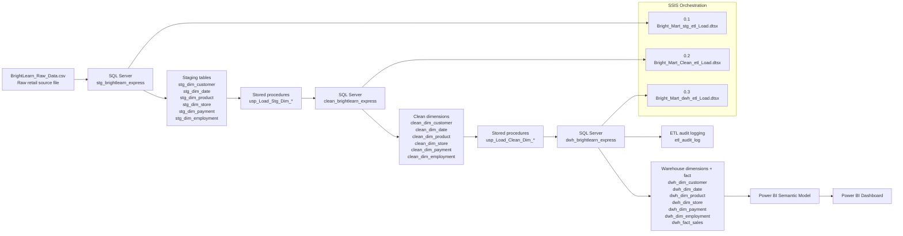
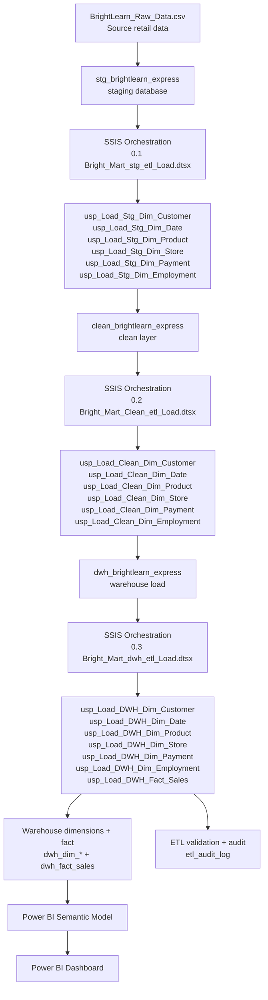

# BrightMart Data Warehouse Project

## Project Overview
This project demonstrates a complete SQL Server-based retail data warehouse implementation using a Bronze → Silver → Gold architecture. The objective was to take raw retail data, validate and clean it, build a dimensional warehouse, and provide a reporting layer that supports business decision-making.

The workflow follows a practical medallion pattern: raw source data is landed in the bronze layer, normalized and staged in the silver layer, and then transformed into a curated reporting-ready warehouse in the gold layer. The project includes:
- Raw source ingestion from the BrightLearn retail export
- Staging and normalization in SQL Server
- Clean dimension preparation for analytics use
- Warehouse modeling with a star schema
- SCD Type 2 handling for customer history
- Fact table loading with integrity constraints
- Stored procedure-based ETL automation
- Audit logging and execution tracking
- Power BI reporting for business analysis

The main goals of this project were to:
- Build a dimensional warehouse for BrightMart retail analytics.
- Design a repeatable ETL process in SQL Server.
- Standardize and cleanse raw transactional data before it reached the reporting model.
- Remove duplicate and inconsistent values from the source feed.
- Preserve customer history using SCD Type 2 logic.
- Track ETL execution with audit logging and validation.
- Deliver a reporting-ready model for Power BI dashboards and business analysis.

---

## Architecture / End-to-End Data Pipeline

### 1. End-to-End Data Pipeline Diagram

This flow reflects the repository structure: the raw BrightLearn export is first landed in the SQL Server staging database, then cleaned into the clean layer, then loaded into the warehouse dimension and fact tables for BI consumption.

## Technologies Used
- SQL Server
- SSIS integration packages
- Stored procedures for ETL automation
- Data warehouse design and dimensional modeling
- Power BI for reporting and dashboarding
- ETL audit logging and validation
- Data cleansing and standardization
- SCD Type 2 historical tracking
- Business intelligence and reporting

## Data Warehouse Design / Star Schema

### 2. Data Warehouse / Star Schema Diagram

The star schema is centred on `dwh_fact_sales` and connects to the repository’s six dimensions: `dwh_dim_customer`, `dwh_dim_product`, `dwh_dim_date`, `dwh_dim_store`, `dwh_dim_payment`, and `dwh_dim_employment`.

## Data Warehouse (Gold Layer)
Once the clean layer was ready, I loaded the Gold warehouse model from those cleaned dimensions.

The Gold layer contains `dwh_fact_sales` and six dimensions: `dwh_dim_customer`, `dwh_dim_product`, `dwh_dim_date`, `dwh_dim_store`, `dwh_dim_payment`, and `dwh_dim_employment`.

The customer dimension uses SCD Type 2 so historical changes can be tracked over time using effective dates, expiry dates, and the `is_current` flag. The remaining dimensions use incremental `NOT EXISTS` loading. The fact table stores the business measures and surrogate keys required for reporting, including quantity, unit price, cost price, discount, stock on hand, reorder threshold, and the associated dimension keys.

Surrogate and foreign keys are used across the model, and referential integrity is enforced to keep the reporting layer reliable.

## ETL Pipeline

### 3. ETL Processing Diagram

The repository uses SSIS to orchestrate the end-to-end pipeline: raw data is landed in `stg_brightlearn_express`, transformed through the clean layer, and then loaded into the Gold warehouse for reporting with audit validation in `etl_audit_log`.

### SSIS Integration Project
The ETL process is automated through three SSIS packages in the Bright_Mart_Project folder:

1. `0.1 Bright_Mart_stg_etl_Load.dtsx` - Loads raw source data into the staging layer and prepares the staged dimensions for transformation.
2. `0.2 Bright_Mart_Clean_etl_Load.dtsx` - Standardizes, cleans, and de-duplicates the staging data before loading the clean dimensions.
3. `0.3 Bright_Mart_dwh_etl_Load.dtsx` - Loads the Gold warehouse dimensions and fact table for reporting and validation.

Each package was designed to orchestrate the SQL Server ETL flow in a repeatable sequence. Successful execution evidence for these packages is available in the repository’s ETL screenshot folder.

## Data Quality & Validation

### SQL Server to Power BI Reconciliation

Power BI measures were validated against aggregate queries in the SQL Server source data warehouse to ensure reporting accuracy.

| Metric | SQL Server Result |
| --- | ---: |
| Fact Rows | 4,747 |
| Distinct Sales Keys | 4,747 |
| Total Quantity | 8,531 |
| Total Sales | R2,102,693.66 |

- Fact rows and distinct sales keys both equal 4,747, confirming one fact record per sales key.
- Power BI totals were reconciled against SQL Server aggregates.
- Power BI may display rounded values such as 9K quantity and 5K transactions in KPI cards, while the exact validated values are 8,531 and 4,747.
- Total Sales reconciles to R2,102,693.66, displayed as approximately R2.10M in Power BI.

## Transformation and Quality Controls
The Bronze, Silver, and Gold layers are connected through a practical ETL flow. The raw file is landed in the Bronze stage, data is normalized and staged in Silver, and the Gold model is built from the cleaned and validated dimensions.

Key transformation controls included:
- `UPPER()` to standardize text values
- `LOWER()` to standardize email addresses
- `LTRIM()` and `RTRIM()` for whitespace cleanup
- `ISNULL()` handling for missing values
- `ROW_NUMBER()` deduplication logic
- `NOT EXISTS` incremental loading
- Customer duplicate resolution using personal details and the most complete email value
- Product/SKU duplicate resolution while preserving the most complete category and supplier details

Audit logging was built into the ETL procedures to track each load with important execution details such as batch ID, procedure name, start/end timestamps, row counts, status, table name, layer name, and error message. This made the pipeline traceable and easier to validate during each run.

## Power BI Dashboard

### 4. Power BI Reporting Layer

Power BI was connected to the SQL Server warehouse and used to build the reporting model from the `dwh_brightlearn_express` tables. The final dashboard layers were designed to summarize leadership performance, customer and product behaviour, and operational inventory health.

#### Executive Overview

This page provides a high-level summary of sales performance and operational health for executive stakeholders.

#### Customer and Product Analysis

This page focuses on customer behaviour and product performance using the warehouse dimensions and fact table.

#### Inventory and Operations

This page highlights stock health, reorder thresholds, and operational indicators for inventory monitoring.

## Key Business Insights
Validated dashboard findings from the final reporting model include:

- Total Sales: R2,102,693.66 (approximately R2.10M)
- Total Quantity: 8,531
- Total Transactions: 4,747
- Total Customers: 50
- Total Products: 44
- Products Below Reorder Threshold: 0
- Low Stock Products: 4
- Lowest Stock Buffer: 3

Customer loyalty sales:
- Gold: R998.52K (47.49%)
- Silver: R680.98K (32.39%)
- Bronze: R423.20K (20.13%)

Customer counts by loyalty tier:
- Bronze: 21
- Silver: 17
- Gold: 12

This project reflects the end-to-end ETL and reporting journey implemented in the repository: raw retail data is landed, staged, cleaned, modeled into a warehouse, and then surfaced through Power BI for business reporting and validation. The result is a structured, auditable, and scalable analytics solution that emphasizes data quality, traceability, repeatability, and actionable insight.

## Repository Structure

### Layer Summary

| Medallion Layer | Purpose | Main Objects |
|---|---|---|
| Bronze | Raw retail transaction landing | BrightLearn_Raw_Data |
| Silver | Initial landing, staging, and standardization | stg_dim_* |
| Gold | Cleaned, curated, reporting-ready dimensions and facts | clean_dim_*, dwh_dim_*, dwh_fact_sales |
| Audit | ETL tracking and monitoring | etl_audit_log |

The repository is organized into the SQL build, staging, cleaning, warehouse, audit, SSIS, and reporting assets used to deliver the end-to-end BrightMart solution.

## Skills Demonstrated
- SQL Server
- ETL Design
- Data Cleansing
- Window Functions
- Star Schema
- SCD Type 2
- Transactions
- TRY...CATCH
- Audit Logging
- Foreign Keys
- Business Analytics
- SSIS orchestration
- Power BI reporting

## How to Explore the Project
1. Start with the raw source file and the SQL scripts under the numbered folders to follow the ETL flow from staging to warehouse creation.
2. Review the staging, clean, and warehouse dimension scripts to understand how the data is progressively transformed and validated.
3. Open the SSIS project in the Bright_Mart_Project folder to see the orchestration of the SQL-based ETL process.
4. Review the Power BI screenshots and the final reporting layer to understand how the warehouse feeds business analysis.
5. Use the audit screenshots and validation steps to trace how quality checks and ETL tracking were built into the solution.

## Author
Boipelo Molotsi
