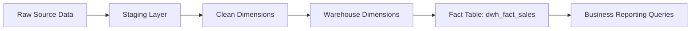
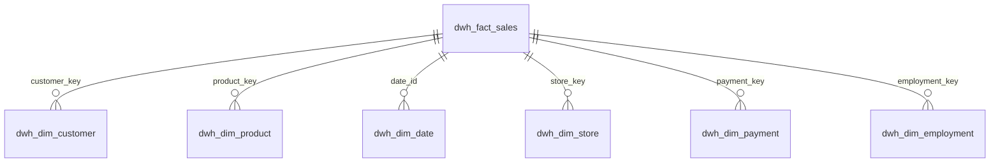

# BrightLearn Express Data Warehouse Project

## Project Overview
This project demonstrates the design and implementation of an end-to-end SQL Server data warehouse for BrightLearn Express using a layered ETL architecture.

The solution follows the classic Staging → Clean → Data Warehouse (Gold) approach and includes:
- Source ingestion
- Data cleansing and standardization
- Star schema dimensional model
- Slowly Changing Dimension (SCD Type 2) for Customer
- Fact table with foreign keys
- Stored procedures
- Audit logging
- Business reporting queries

---

## Architecture

```text
Raw CSV
   │
   ▼
BrightLearn_Raw_Data
   │
   ▼
STAGING DATABASE
 ├── stg_dim_customer
 ├── stg_dim_date
 ├── stg_dim_product
 ├── stg_dim_store
 ├── stg_dim_payment
 └── stg_dim_employment
   │
   ▼
CLEAN DATABASE
 ├── clean_dim_customer
 ├── clean_dim_date
 ├── clean_dim_product
 ├── clean_dim_store
 ├── clean_dim_payment
 └── clean_dim_employment
   │
   ▼
DATA WAREHOUSE (GOLD)
 ├── dwh_dim_customer (SCD Type 2)
 ├── dwh_dim_date
 ├── dwh_dim_product
 ├── dwh_dim_store
 ├── dwh_dim_payment
 ├── dwh_dim_employment
 └── dwh_fact_sales
```

### ETL Flow Diagram



### Star Schema Overview



## Project Objectives
- Build a dimensional data warehouse.
- Implement ETL using SQL Server.
- Clean and standardize source data.
- Remove duplicates.
- Preserve customer history using SCD Type 2.
- Track ETL execution using audit logging.
- Produce business intelligence queries.

## Stage 1 – Staging Layer
The raw CSV was imported into BrightLearn_Raw_Data.

Separate staging dimensions were created for:
- Customer
- Date
- Product
- Store
- Payment
- Employment

Distinct records were loaded from the raw table.

## Stage 2 – Clean Layer
Each staging dimension was transformed into a clean dimension.

Typical transformations included:
- UPPER() for names
- LOWER() for email addresses
- LTRIM/RTRIM
- ISNULL defaults
- Duplicate removal with ROW_NUMBER()
- NOT EXISTS incremental loading

Special handling:
- Customer duplicates resolved using first/last name and preferred populated email.
- Product duplicates resolved by SKU while preferring populated category/supplier values.

## Audit Logging
Each ETL stored procedure writes to an ETL audit table.

Captured:
- Batch ID
- Procedure Name
- Start Time
- End Time
- Rows Inserted
- Status
- Error Message
- Table Name
- Layer Name

TRY...CATCH and transactions ensure reliable loads.

## Data Warehouse
Dimensions were loaded from the Clean layer.

Customer dimension implements SCD Type 2:
- Effective Date
- Expiry Date
- Is_Current flag

Other dimensions use incremental NOT EXISTS loading.

The fact table stores:
- Date Key
- Customer Key
- Product Key
- Store Key
- Payment Key
- Employment Key
- Measures:
  - Quantity
  - Revenue
  - Unit Price
  - Cost Price
  - Discount
  - Stock on Hand
  - Reorder Threshold

Foreign keys enforce referential integrity.

## Reporting
Business questions answered included:
1. Top 5 products by revenue.
2. Monthly revenue per store.
3. Month-over-month revenue growth using LAG().
4. Top 10 loyalty customers.
5. Customers inactive since 28-Apr-2024.
6. Average transaction value by loyalty tier.
7. Quantity sold by category and store.
8. Inventory below reorder threshold.

Findings:
- Every customer purchased after 28 April 2024.
- No June inventory was below reorder threshold.
- January growth is NULL because there is no previous month.

## Layer Summary

| Layer | Purpose | Main Objects |
|---|---|---|
| Source | Raw retail transaction data | BrightLearn_Raw_Data |
| Staging | Initial landing and standardization | stg_dim_* |
| Clean | Cleaned and business-ready dimensions | clean_dim_* |
| Warehouse | Reporting-ready dimensional model | dwh_dim_*, dwh_fact_sales |
| Audit | ETL tracking and monitoring | etl_audit_log |

## Screenshots


## Skills Demonstrated
- SQL Server
- ETL Design
- Data Cleansing
- Window Functions
- Star Schema
- SCD Type 2
- Transactions
- TRY...CATCH
- Audit Logging
- Foreign Keys
- Business Analytics

## Conclusion
This project demonstrates a complete enterprise-style ETL pipeline from raw operational data through staging, cleansing, and dimensional modeling into a reporting-ready data warehouse. It emphasizes data quality, historical tracking, repeatable ETL processes, and business-focused reporting.
