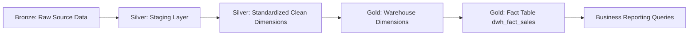
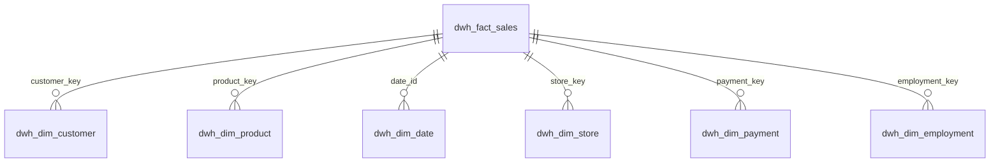

# BrightMart Data Warehouse Project

## Project Overview
I built this project to show how I can take raw retail data, transform it through a medallion architecture, and deliver a reporting-ready SQL Server data warehouse.

My workflow follows the Bronze → Silver → Gold pattern. I start with the raw source file, land it in Bronze, clean and normalize it in Silver, and then load the curated reporting model into Gold. This project covers:
- Bronze-level raw ingestion from the source feed
- Silver-level staging and normalization
- Gold-level warehouse modeling for analytics and reporting
- Data quality improvements and standardization
- Star schema design for analysis
- SCD Type 2 handling for customer history
- Fact table loading with referential integrity
- Stored procedure-based ETL automation
- Audit logging and execution tracking
- Business reporting queries

---

## Architecture

```text
BRONZE LAYER
   Raw CSV / Source Feed
   |
   v
BrightLearn_Raw_Data
   |
   v
SILVER LAYER
   stg_dim_customer
   stg_dim_date
   stg_dim_product
   stg_dim_store
   stg_dim_payment
   stg_dim_employment
   |
   v
GOLD LAYER
   clean_dim_customer
   clean_dim_date
   clean_dim_product
   clean_dim_store
   clean_dim_payment
   clean_dim_employment
   |
   v
DATA WAREHOUSE / GOLD REPORTING MODEL
   dwh_dim_customer (SCD Type 2)
   dwh_dim_date
   dwh_dim_product
   dwh_dim_store
   dwh_dim_payment
   dwh_dim_employment
   dwh_fact_sales
```

### ETL Flow Diagram



### Star Schema Overview



## Project Objectives
My goal for this project was to:
- Build a dimensional warehouse for BrightLearn Express.
- Implement a repeatable ETL process using SQL Server.
- Clean and standardize the raw source data before it enters the reporting model.
- Remove duplicates and inconsistent values from the incoming feed.
- Preserve customer history with SCD Type 2.
- Track ETL execution with audit logging.
- Produce business intelligence queries from the final warehouse.

## Stage 1 - Bronze Layer: Raw Landing
I started by loading the raw CSV into BrightLearn_Raw_Data as the Bronze landing layer. This is where the original source feed first enters the medallion architecture before any SQL-based quality cleanup begins.

From there, I created the Silver staging dimensions for:
- Customer
- Date
- Product
- Store
- Payment
- Employment

I then loaded distinct records into the staging schema so the data was prepared for the next transformation step.


## Stage 2 - Silver Layer: Staging and Standardization
This is the Silver layer where I prepared the data for business use. The staging tables were built to hold the raw source rows in a structured format, and then I standardized them into a cleaner representation that the Gold layer could consume confidently.

Typical transformations included:
- UPPER() for names
- LOWER() for email addresses
- LTRIM/RTRIM
- ISNULL defaults
- Duplicate removal with ROW_NUMBER()
- NOT EXISTS incremental loading

Special handling:
- Customer duplicates were resolved using first name, last name, and the most complete email field.
- Product duplicates were resolved by SKU while prioritizing the most complete category and supplier values.


## Stage 3 - Silver to Gold Clean Layer
I transformed each staging dimension into a cleaned version that was ready for the Gold layer. This step is where the medallion design starts to become visible as data moves from raw and somewhat messy to trustworthy and business-ready.

The clean dimensions were then used as the foundation for the final warehouse load, so the reporting model would not be based on unreliable data.


## Audit Logging
I also built audit logging into each ETL stored procedure so the pipeline could be monitored, traced, and validated throughout the load process.

The audit table captures:
- Batch ID
- Procedure Name
- Start Time
- End Time
- Rows Inserted
- Status
- Error Message
- Table Name
- Layer Name

TRY...CATCH and transaction control help keep the loads reliable.


## Data Warehouse (Gold Layer)
Once the clean layer was ready, I loaded the Gold warehouse model from those cleaned dimensions.

The customer dimension uses SCD Type 2 so historical changes can be tracked over time:
- Effective Date
- Expiry Date
- Is_Current flag

The other dimensions use incremental NOT EXISTS loading.

The fact table stores the business measures and surrogate keys needed for reporting:
- Date Key
- Customer Key
- Product Key
- Store Key
- Payment Key
- Employment Key
- Quantity
- Revenue
- Unit Price
- Cost Price
- Discount
- Stock on Hand
- Reorder Threshold

Foreign keys enforce referential integrity across the model.


## Reporting
The reporting layer answers business questions such as:
1. Top 5 products by revenue
2. Monthly revenue per store
3. Month-over-month revenue growth using LAG()
4. Top 10 loyalty customers
5. Customers inactive since 28-Apr-2024
6. Average transaction value by loyalty tier
7. Quantity sold by category and store
8. Inventory below reorder threshold

Key findings from the analysis included:
- Every customer purchased after 28 April 2024.
- No June inventory was below reorder threshold.
- January growth is NULL because there is no previous month.


## Layer Summary

| Medallion Layer | Purpose | Main Objects |
|---|---|---|
| Bronze | Raw retail transaction landing | BrightLearn_Raw_Data |
| Silver | Initial landing, staging, and standardization | stg_dim_* |
| Gold | Cleaned, curated, reporting-ready dimensions and facts | clean_dim_*, dwh_dim_*, dwh_fact_sales |
| Audit | ETL tracking and monitoring | etl_audit_log |

## SSIS Integration Project
I also built an SSIS integration project in the repository under the Bright_Mart_Project folder so I could automate the entire ETL workflow end-to-end.

What I did in SSIS was turn the SQL stored-procedure pipeline into a visual orchestration process. Instead of executing each procedure manually, I connected the stages into ordered packages that run one after the other.

### SSIS workflow I implemented

#### 1. Staging package
Package: 0.1. Bright_Mart_stg_etl_Load.dtsx

In this package, I created Execute SQL Task components for the staging procedures and linked them in sequence:
1. usp_Load_Stg_Dim_Customer
2. usp_Load_Stg_Dim_Date
3. usp_Load_Stg_Dim_Product
4. usp_Load_Stg_Dim_Store
5. usp_Load_Stg_Dim_Payment
6. usp_Load_Stg_Dim_Employment

This stage lands the raw source data into the Silver staging database and prepares it for transformation.


#### 2. Clean package
Package: 0.2. Bright_Mart_Clean_etl_Load.dtsx

In the clean package, I chained the clean-layer procedures so the staging data could be transformed into business-ready dimensions.

The sequence was:
1. usp_Load_Clean_Dim_Customer
2. usp_Load_Clean_Dim_Date
3. usp_Load_Clean_Dim_Product
4. usp_Load_Clean_Dim_Store
5. usp_Load_Clean_Dim_Payment
6. usp_Load_Clean_Dim_Employment

This stage is where I standardized the fields, cleaned inconsistent values, and removed duplicate records.


#### 3. Warehouse package
Package: 0.3. Bright_Mart_dwh_etl_Load.dtsx

In the Gold package, I ran the warehouse load procedures in order so the dimensions and fact table could be built for reporting.

The execution order was:
1. usp_Load_DWH_Dim_Customer
2. usp_Load_DWH_Dim_Date
3. usp_Load_DWH_Dim_Product
4. usp_Load_DWH_Dim_Store
5. usp_Load_DWH_Dim_Payment
6. usp_Load_DWH_Dim_Employment
7. usp_Load_DWH_Fact_Sales

This final stage gave me the Gold reporting model with the fact table and dimension keys ready for analysis.


### Why I used SSIS
I used SSIS because it let me turn the ETL process into something visual, structured, and repeatable. It helped me:
- automate the whole SQL loading chain
- control execution order with precedence constraints
- reuse SQL Server connections across the three environments
- monitor the package flow more clearly
- make the ETL process easier to explain and present

### SSIS screenshots and illustrations I captured
I saved a set of screenshots and diagrams in the ETL screenshots folder so the SSIS story is documented visually as well as in SQL.

These visual assets show the architecture, the SSIS package flow, and the successful execution results:
- SSIS_Load_stg_etl_pipeline.PNG - staging package design
- SSIS_Load_clean_etl_pipeline.PNG - clean package design
- SSIS_Load_dwh_etl_pipeline.PNG - warehouse package design
- SSIS_Load_stg_etl_pipeline_execute_results.PNG - staging execution output
- SSIS_Load_clean_etl_pipeline_execute_results.PNG - clean execution output
- SSIS_Load_dwh_etl_pipeline_execute_results.PNG - warehouse execution output
- SSIS_stg_etl_ran_successfully.PNG - staging success confirmation
- SSIS_Clean_etl_ran_successfully.PNG - clean success confirmation
- SSIS_dwh_etl_ran_successfully.PNG - warehouse success confirmation
- bright_mart_express_diagram.PNG - architectural overview diagram
- audit_logging_stg_dim_customer.PNG - staging audit evidence
- audit_logging_clean_dim_customer.PNG - clean audit evidence
- audit_logging_dwh_dim_customer.PNG - warehouse audit evidence
- audit_logging_dwh_fact_sales.PNG - fact table audit evidence

These screenshots and diagrams are the visual proof that my SSIS workflow was built and executed successfully.

## Skills Demonstrated
- SQL Server
- ETL Design
- Data Cleansing
- Window Functions
- Star Schema
- SCD Type 2
- Transactions
- TRY...CATCH
- Audit Logging
- Foreign Keys
- Business Analytics

## Conclusion
This project reflects the full ETL journey I implemented: starting with Bronze raw sales data, moving through Silver staging and cleaning, and finishing with a Gold reporting-ready warehouse. The final result is a solution that emphasizes data quality, traceability, repeatability, and business-focused reporting.
